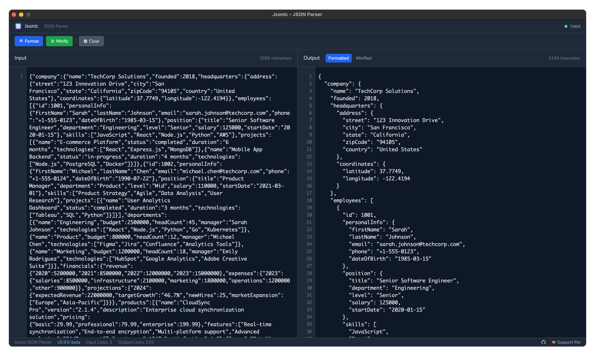

# 🚀 Jsonic JSON Parser

<div align="center">


**A modern, fast, and intuitive JSON parser built with Go and React**

[](https://github.com/enderkus/jsonic)
[](LICENSE)
[](https://github.com/enderkus/jsonic)
[](https://wails.io)

[Features](#-features) • [Installation](#-installation) • [Usage](#-usage) • [Development](#-development) • [Contributing](#-contributing)

</div>

---

## 📖 Overview

Jsonic is a powerful desktop JSON parser that provides real-time validation, formatting, and minification capabilities. Built with modern technologies including Go backend and React frontend, it offers a seamless experience for developers working with JSON data.

### ✨ Why Jsonic?

- **🚀 Lightning Fast**: Native performance with Go backend
- **🎨 Modern UI**: Clean, professional interface with dark theme
- **📏 Line Numbers**: Synchronized line numbers with smooth scrolling
- **✅ Real-time Validation**: Instant JSON syntax checking
- **🔄 Format & Minify**: One-click JSON formatting and minification
- **💻 macOS Native**: Optimized for macOS with native performance

---

## 📸 Screenshot

<div align="center">



*Jsonic in action - showing JSON validation, formatting, and synchronized line numbers*

</div>

---

## 🎯 Features

### Core Functionality
- **JSON Validation**: Real-time syntax checking with detailed error messages
- **JSON Formatting**: Pretty-print JSON with proper indentation (2 spaces)
- **JSON Minification**: Compress JSON to single-line format
- **Dual Panel Layout**: Side-by-side input and output panels

### User Experience
- **Line Numbers**: Synchronized line numbers for both input and output
- **Character Count**: Real-time character counting
- **Line Count**: Display total lines for input and output
- **Error Indicators**: Visual feedback for JSON validity
- **Tab System**: Switch between formatted and minified output

### Technical Features
- **Native Performance**: Built with Go for optimal speed
- **Modern Frontend**: React with TypeScript and Tailwind CSS
- **Responsive Design**: Adaptive layout for different screen sizes
- **Memory Efficient**: Optimized for large JSON files

---

## 🛠 Installation

### Download Pre-built Binaries

1. Go to the [Releases](https://github.com/enderkus/jsonic/releases) page
2. Download the macOS version:
   - **macOS Intel**: `Jsonic-darwin-amd64.app`
   - **macOS Apple Silicon**: `Jsonic-darwin-arm64.app`

> 📋 **Coming Soon**: Windows and Linux support will be added in future releases

### Build from Source

#### Prerequisites
- [Go](https://golang.org/dl/) 1.19 or later
- [Node.js](https://nodejs.org/) 16 or later
- [Wails CLI](https://wails.io/docs/gettingstarted/installation)
- macOS 10.15 or later

#### Steps
```bash
# Clone the repository
git clone https://github.com/enderkus/jsonic.git
cd jsonic

# Install Wails CLI (if not already installed)
go install github.com/wailsapp/wails/v2/cmd/wails@latest

# Build the application
wails build

# The built application will be in build/bin/Jsonic.app
```

### Building

```bash
# Build for current platform (macOS)
wails build

# Build for specific macOS architecture
wails build -platform darwin/amd64    # Intel Macs
wails build -platform darwin/arm64    # Apple Silicon Macs
```

---

## 🚀 Usage

### Basic Operations

1. **Launch Jsonic**: Open the application
2. **Input JSON**: Paste or type your JSON in the left panel
3. **Real-time Validation**: See validation status in the top bar
4. **Format JSON**: Click the "Format" button for pretty-printed output
5. **Minify JSON**: Click the "Minify" button for compressed output
6. **Switch Views**: Use "Formatted" and "Minified" tabs in the output panel

### Keyboard Shortcuts

- **Ctrl/Cmd + A**: Select all text in active panel
- **Ctrl/Cmd + C**: Copy selected text
- **Ctrl/Cmd + V**: Paste text
- **Ctrl/Cmd + Z**: Undo (in input panel)

### Tips & Tricks

- **Large Files**: Jsonic handles large JSON files efficiently
- **Error Detection**: Invalid JSON is highlighted with error messages
- **Line Navigation**: Use line numbers to quickly locate specific parts
- **Copy Output**: Click in output panel and copy formatted/minified JSON

---

## 🏗 Development

### Project Structure

```
jsonic/
├── app.go              # Go backend logic
├── main.go             # Application entry point
├── wails.json          # Wails configuration
├── frontend/           # React frontend
│   ├── src/
│   │   ├── App.tsx     # Main React component
│   │   ├── App.css     # Styles
│   │   └── assets/     # Static assets
│   ├── package.json    # Frontend dependencies
│   └── dist/           # Built frontend (generated)
└── build/              # Built application (generated)
```

### Development Setup

```bash
# Clone and enter directory
git clone https://github.com/enderkus/jsonic.git
cd jsonic

# Install frontend dependencies
cd frontend
npm install
cd ..

# Run in development mode
wails dev
```

### Technology Stack

- **Backend**: Go 1.19+
- **Frontend**: React 18 + TypeScript
- **Styling**: Tailwind CSS 3.4
- **Build Tool**: Vite
- **Desktop Framework**: Wails v2
- **Font**: JetBrains Mono

---

## 🤝 Contributing

We welcome contributions! Here's how you can help:

### Reporting Issues

1. Check existing [issues](https://github.com/enderkus/jsonic/issues)
2. Create a new issue with:
   - Clear description
   - Steps to reproduce
   - Expected vs actual behavior
   - System information

### Development Contributions

1. Fork the repository
2. Create a feature branch: `git checkout -b feature/amazing-feature`
3. Make your changes
4. Test thoroughly
5. Commit: `git commit -m 'Add amazing feature'`
6. Push: `git push origin feature/amazing-feature`
7. Open a Pull Request

### Code Style

- **Go**: Follow standard Go formatting (`gofmt`)
- **TypeScript/React**: Use ESLint and Prettier
- **Commits**: Use conventional commit messages

---

## 📝 Changelog

### v0.9.0-beta (Current)
- ✨ Initial beta release
- ✅ JSON validation, formatting, and minification
- 🎨 Modern dark theme UI
- 📏 Synchronized line numbers
- 🔄 Dual panel layout
- 💻 macOS native support (Intel & Apple Silicon)

### Roadmap to v1.0.0
- 🐛 Bug fixes based on user feedback
- ⚡ Performance optimizations
- 🎨 UI/UX improvements
- 📱 Better responsive design
- 🔧 Additional configuration options
- 🖥️ Windows and Linux platform support

---

## 📄 License

This project is licensed under the MIT License - see the [LICENSE](LICENSE) file for details.

---

## 💖 Support

If you find Jsonic useful, consider supporting the project:

- ⭐ Star this repository
- 🐛 Report bugs and suggest features
- 💰 [Buy me a coffee](https://buymeacoffee.com/enderk)
- 📢 Share with your developer friends

---

## 🙏 Acknowledgments

- [Wails](https://wails.io) - For the amazing Go + Web framework
- [React](https://reactjs.org) - For the powerful frontend library
- [Tailwind CSS](https://tailwindcss.com) - For the utility-first CSS framework
- [JetBrains Mono](https://www.jetbrains.com/mono/) - For the beautiful monospace font

---

<div align="center">

**Made with ❤️ by [Ender KUŞ](https://github.com/enderkus)**

[GitHub](https://github.com/enderkus/jsonic) • [Issues](https://github.com/enderkus/jsonic/issues) • [Releases](https://github.com/enderkus/jsonic/releases)

</div>